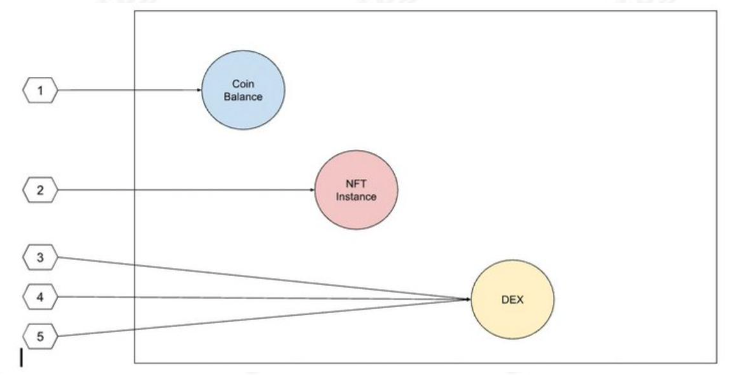
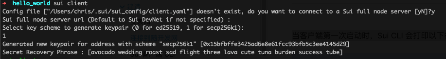
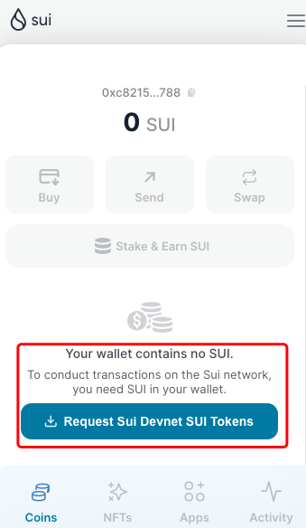
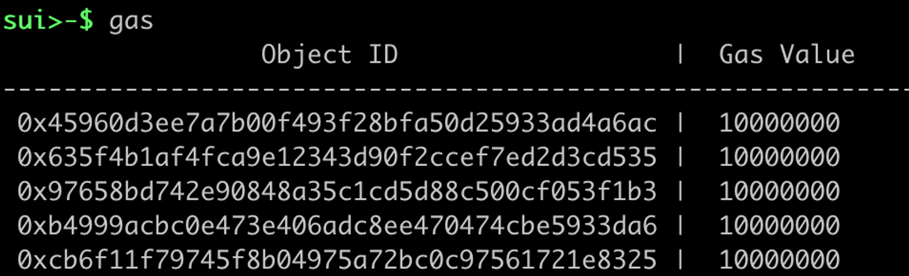
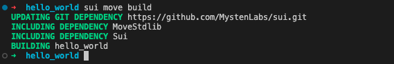
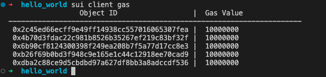
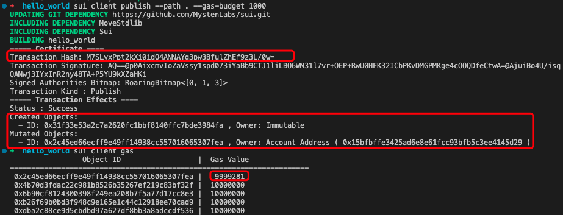
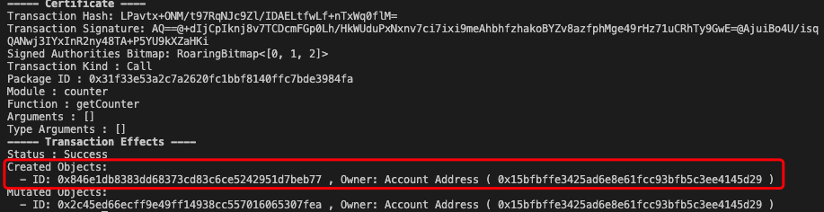
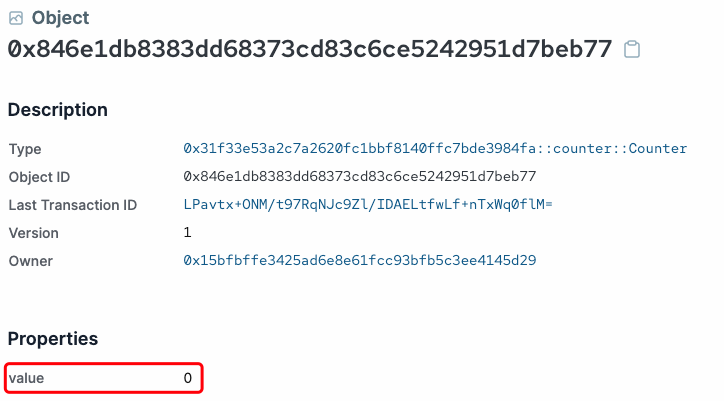
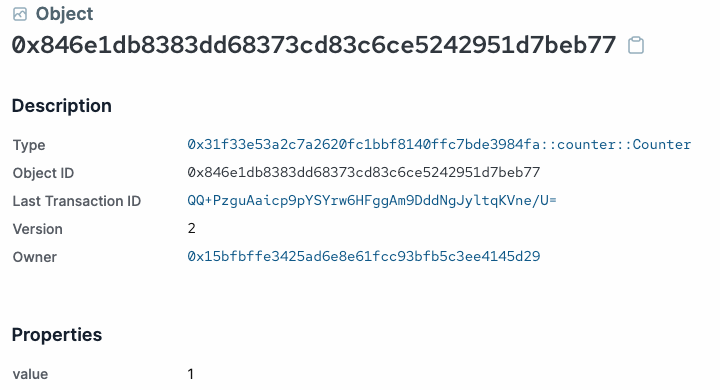

# Sui简单介绍

Sui 是由 Mysten Labs 团队开发的高性能公链，目标是建设安全、高效、大规模使用的智能合约平台，完善的web 3基础设施，Sui主要相比于其他区块链有以下特点：

- 区分了简单交易和复杂交易，采用不同的共识机制，实行大规模并行计算。
- 采用“面向资源”的 Sui Move 语言，提供更具备安全性和可组合性的区块链编程语言。

Aptos 和 Sui 都采用了Move这一语言，不过，具体使用的模型略有不同。Aptos 使用 Diem 团队创建的Core Move 语言，而 Sui 正在利用他们自己的替代版本，称为“Sui Move”，对象是Sui Move中最基础的概念，像组织数据，某款 NFT 、某个代币的余额、某项智能合约，这些都是不同的对象，

这意味着 Sui 链上的交易可以根据对象的不同可以来分组处理。使得大规模并行计算成为可能。下图是一个简单的例子，描述了可分为 3 组的 5 笔不同交易。这 3 组交易完全可以实现并行处理。



# 环境搭建

本节可以了解到如何安装和配置 Sui，在安装 Sui 之前，您需要安装一些必备工具并配置您的开发环境。

## 工具安装

Sui 需要在所有支持的操作系统上使用 Rust 和 Cargo。一些操作系统需要 cURL 来下载 Rust 和 Cargo，因此如有必要，请检查相关先决条件部分以先安装 cURL，接下来的安装我们以Linux系统为例。

使用以下命令在 macOS 或 Linux 上安装 Rust 和 Cargo：

```
curl --proto '=https' --tlsv1.2 -sSf https://sh.rustup.rs | sh
```

随后安装

```
sudo apt-get install curl git-all libssl-dev libclang-dev
```

## 安装Sui

安装 Cargo 后，使用以下命令安装 Sui 二进制文件：

```
cargo install --locked --git https://github.com/MystenLabs/sui.git --branch devnet sui
```

输入以下命令查看安装是否成功

```
sui --version
```

## 命令行

安装完Sui 二进制文件后，我们便可以与Sui Devnet交互。

要将 Sui 客户端连接到 Sui Devnet，请运行以下命令：

```shell
sui client
```

当客户端第一次启动时，Sui CLI 会打印以下行：

```shell
Config file ["/Users/dir/.sui/sui_config/client.yaml"] doesn't exist, do you want to connect to a Sui RPC server [y/n]?
```

键入`y`然后按`Enter`。您应该看到以下输出：

```shell
Sui RPC server Url (Default to Sui Devnet if not specified) :
```

Sui 客户端会提示您输入 RPC 服务器 URL。按 Enter 以使用 Devnet 的默认值。您还可以输入自定义 URL 以连接到自定义 RPC 端点。

```shell
Select key scheme to generate keypair (0 for ed25519, 1 for secp256k1):
```

键入`0`或`1`选择密钥方案，并创建了账户地址为`0x15bfbffe3425ad6e8e61fcc93bfb5c3ee4145d29`



如果想重置客户端配置，可以删除用户下的sui文件夹即可

```
rm ~/.sui/sui_config/*
```

## 获取测试代币

通过以上步骤，我们获得了一个可以使用的账户和对应的助记词信息

输入Sui console进入Sui控制台，随后输入`active-address`查看当前默认地址

```shell
sui client active-address
```

要获得测试代币可以在sui wallet中导入之前的助记词信息，随后点击request按钮即可。



第二种方式是加入[Discord](https://discord.gg/sui)，在[faucet频道](https://discord.com/channels/916379725201563759/971488439931392130)输入你的地址，从而获取代币。例如（注意前面的感叹号）：

```solidity
!faucet 0x1083871113de333758c3d46136030d573f09ae18
```

.png)

.png)

输入地址

.png)

随后查看gas，请求一次会获得5个Sui代币



# 合约目录结构

Move中的代码组织（和分发）的主要单位是**包**。包由一组模块组成，这些模块定义在`.move`扩展名的单独文件中。这些文件包括 Move 函数和类型定义。一个Move包必须包含`Move.toml`描述包配置的清单文件，例如包元数据或包依赖项。在我们先不要担心模块的其余内容，稍后您可以在 Move 书中阅读更多关于[模块的内容](https://movebook.chrisyy.top/modules-and-scripts.html)

首先，我们创建一个空的 Move 包：

```
sui move new hello_world
```

这将创建一个名叫hello_world的Move包，包含`toml`文件和`sources`文件夹，这一个最简单的包目录结构如下所示：

```
.
├── Move.toml
└── sources
```

查看Move.toml文件

```
[package]
name = "hello_world"
version = "0.0.1"

[dependencies]
Sui = { git = "https://github.com/MystenLabs/sui.git", subdir = "crates/sui-framework", rev = "devnet" }

[addresses]
hello_world =  "0x0"
sui =  "0000000000000000000000000000000000000002"
```

其中内容有：

- 名称和版本（`[package]`部分）
- 此包依赖的其他包（`[dependencies]`部分）。该包只依赖Sui Framework，其他第三方依赖需要在这里添加。
- 命名地址列表（`[addresses]`部分）。这些名称可以用作源代码中给定地址的方便别名。

# 第一个Move合约

## 编写

让我们从在包中创建一个源文件开始我们的合约：

```shell
touch hello_world/sources/my_module.move
```

在文件中填入以下内容：

```move
module hello_world::counter {
    // Part 1: imports
    use sui::transfer;
    use sui::object::{Self, UID};
    use sui::tx_context::{Self, TxContext};

    // Part 2: struct definition
    struct Counter has key {
        id: UID,
        value: u64,
    }

    // Part 3: transfer the counter object to the sender
    entry public fun getCounter(ctx: &mut TxContext) {
        // sender address
        let sender = tx_context::sender(ctx);
        let counter_obj = Counter {
            id: object::new(ctx),
            value: 0
        };
        transfer::transfer(counter_obj, sender);
    }

    // part 4: public/ entry functions
    public entry fun incr(counter: &mut Counter) {
        counter.value = counter.value + 1;
    } 
}
```

此合约的功能是一个简单的计数器合约：

- 用户可以调用`getCounter`获得一个`Counter`计数器对象
- 用户可以调用并且能够让他的`value`值+1

让我们分解这段代码为四个不同部分：

1. Part1导入：这些允许我们的模块使用在其他模块中声明的类型和函数。在此模块中，我们从三个不同的模块中引入导入，分别是`transfer`，`object`，`tx_context`，其作用我们在下文解释。
2. Part2结构声明：这里定义了可以由该模块创建/销毁的类型。这里的`key` 表明这些结构是作为全局索引资源。`store`能力允许它存储在其他结构的字段中并可以自由转移。
3. Part3`getCounter`函数：向调用者转入一个`Counter`对象
4. Part4`incr`函数：传入一个对象的可变引用，并对其value字段+1

合约一开始引入了`transfer`库，`transfer`函数有两个参数一个是被对象，二是接受者地址，能够转让一个对象的所有权给另一个地址，同时这个对象必须有一个全局独一无二的`ID`也就是`Counter`中的`id`字段，这个`ID`就是由`object`中的`new`函数生成，`new`函数接受当前交易的上下文作为参数，从而生成一个独一无二的`ID`。

编写完成之后，我们需要位于项目的根目录，然后使用`sui move build`来编译它。

```
sui move build
```

成功的构建会返回类似于以下内容的响应：



如果构建失败，可以通过日志输出中的错误信息来排除和解决问题。

## 部署

现在我们已经能够编译合约，那么这一节让我们发布我们的合约。

首先确保我们的账户已经有一定的测试代币



发布合约和调用合约，我们都可以使用 Sui CLI 客户端来完成。

Sui中的发布命令`publish`要求我们指定用户定义包所在的目录。同时需要设置gas消耗一个上限，我们使用 1000 作为我们的 gas 预算，所以通过如下命令来发布我们的合约。更多的命令请参阅 [Sui CLI 客户端文档。](https://docs.sui.io/build/cli-client)

```
sui client publish --gas-budget 10000
```

发布时，Sui还会再次编译，随后会返回交易哈希，发布结果，交易结果等等。这些信息可以通过交易哈希在[区块浏览器](https://explorer.sui.io/transactions/M7SLyxPpt2kXi0idQ4ANNAYg3pw3BfulZhEf9z3L%2F0w%3D)上找到。



可以发现，运行此命令会创建一个`Immutable`类型的对象（0x31f33e53a2c7a2620fc1bbf8140ffc7bde3984fa），在sui中的对象包含三种类型：

- `owned`：这是 Move 对象最常见的对象。在Sui中每一个对象都属于一个地址，并且这个拥有权可以在 Move 代码中[转移](https://docs.sui.io/build/move/sui-move-library)到另一个地址。

- `immutable`：这意味着一个对象是不可变的，不能被任何人改变。因此，这样的对象没有拥有者。任何人都可以在他们的 Move 通话中使用它。并且所有 Move 包都是不可变对象：一旦发布，就无法更改。在Move代码中可以通过[freeze_object](https://docs.sui.io/build/move/sui-move-library)库 API将对象变成不可变对象。不可变对象只能作为只读引用 ( `&T`) 在 Move 调用中传递。

- `shared`：对象可以共享，这意味着任何人都可以读取或写入该对象。与可变拥有的对象（单写者）相比，共享对象需要[共识](https://docs.sui.io/learn/architecture/consensus)来排序读取和写入。有关创建和访问共享对象的示例，请参阅https://examples.sui.io/上的[共享对象](https://examples.sui.io/basics/shared-object.html#shared-object)。

在交易最后，我们看到用于支付发布费用的 gas 对象（0x2c45ed66ecff9e49ff14938cc557016065307fea）由于支付了gas费从而也被修改了。

## 调用

为了获得一个`Counter`计数器对象并且，使得`Counter`计数器对象中的值增加，我们需要调用合约中的函数。

在函数`getCounter`中，存在`public`，`entry`修饰符，这保证了我们拥有调用权限，并且可以通过命令行调用。`transfer`函数的参数为对象接收者地址，在代码中，我们通过`tx_context::sender(ctx)`来获取发送者地址，`ctx`是当前交易的上下文，包含此交易的相关信息。

所以我们首先需要调用`getCounter`函数，在命令行输入如下命令。

```
sui client call \
    --function getCounter \
    --module counter \
    --package 0x31f33e53a2c7a2620fc1bbf8140ffc7bde3984fa \
    --gas-budget 1000
```

这是一个相当复杂的命令，所以让我们一一解释它的所有参数：

- `--function`：要调用的函数的名称
- `--module`：包含函数的模块的名称
- `--package`：包含函数的模块所在的包对象的 `ID`。
- `--gas-budge`：是一个十进制数，表示我们交易的gas上限，以避免 gas pay 中所有 gas 的意外耗尽）

可以发现交易结果中返回了一个新创建的对象`ID`，很明显这就是我们获得的`Counter`对象



同时在浏览器上可以直接通过对象`ID`看到`counter`的`value`字段的具体值



最后我们试图调用`incr`来使得`value`的值+1

```
sui client call \
    --function incr \
    --module counter \
    --package 0x31f33e53a2c7a2620fc1bbf8140ffc7bde3984fa \
    --args 0x846e1db8383dd68373cd83c6ce5242951d7beb77 \
    --gas-budget 1000
```

其中`--args`用来传递我们的参数，参数格式参考 [Sui-JSON](https://docs.sui.io/build/sui-json)值的函数参数列表。

再次通过浏览器可以发现version（可以理解为修改的次数）被+1，同时`value`的字段值也成功+1



以上是Sui Move合约开发入门的第一节，[此处](https://github.com/chrisyy2003/sui-by-example/tree/main/hello_world)可以查看本文提到的代码。在Sui入门的第二节会来带Sui中的`Event`，初始化`Init`函数和Sui合约测试的相关内容。
